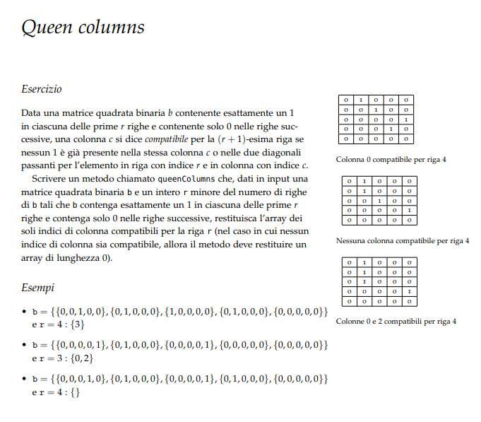
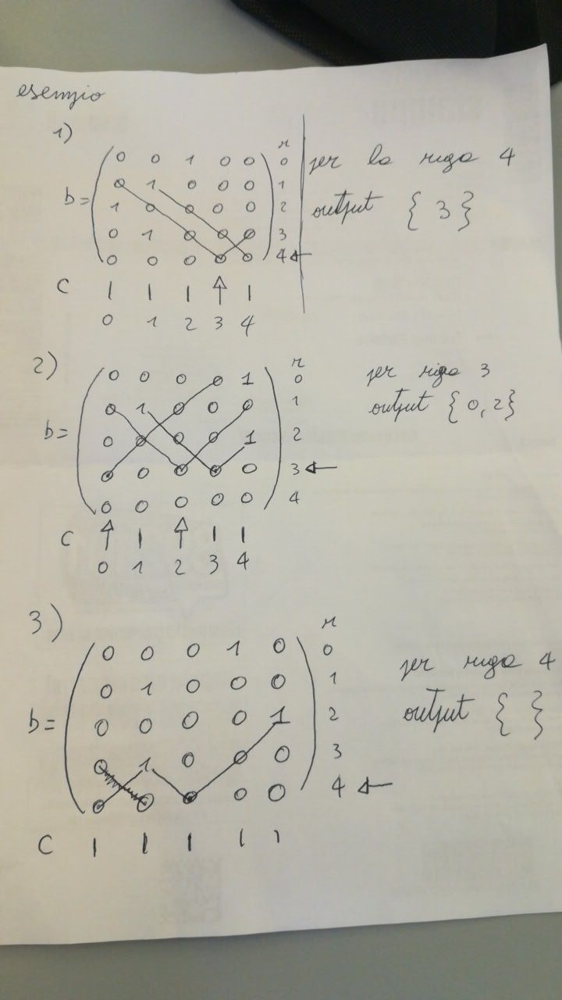

# QueenColumns
**Questa repository si autodistruggerà tra meno di 24h**

## Testo dell'esercizio


## Soluzione degli esempi


## Elaborazione della soluzione
L'esercizio chiede la creazione di un metodo di risoluzione di questo problema prendendo in input la matrice e la riga da esaminare.
Quello che conviene fare è di analizzare prima se esistono delle colonne che non contengono 1, se non ce ne sono ci si ferma e si restituisce l'array vuoto.
Se ci sono useremo un array booleano di lunghezza pari al numero di colonne della matrice: il valore vero indicherà che non ci sono 1 in quella colonna, valore falso se ci sono.
Prendendo quindi solo le colonne con valore vero dobbiamo eseguire 2 cicli per analizzare la diagonale sinistra e la diagonale destra dell'elemento considerato.
Con annessi controlli interni la soluzione è questa:
```
private static int[] queenColumns(int[][] b, int r) {
		boolean[] oneController = new boolean[b.length];
		boolean possible = false;
		int firstPossibleColumn = 0;
		int lastPossibleColumn = 0;
		for (int columns = 0; columns < b.length; columns++) {
			oneController[columns] = true;
			for (int raw = 0; raw < b.length && oneController[columns]; raw++) {
				if (b[raw][columns] == 1) {
					oneController[columns] = false;
				}
			}
			// questo controllo serve a capire se almeno una colonna è vuota
			if (oneController[columns]) {
				if (!possible) {
					possible = true;
					firstPossibleColumn = columns;
				}
				lastPossibleColumn = columns;
			}
		}
		// dato che se in ogni colonna ci sono 1 è inutile continuare
		if (!possible) {
			return null;
		}
		// se almeno una colonna è vuota allora si continua
		int indexController = firstPossibleColumn;
		int counter = 0;
		while (indexController < lastPossibleColumn) {
			if (oneController[indexController]) {
				// controllo sulla diagonale che parte dall'elemento [r][index] in alto a destra
				for (int diagonalUpDx = 1; indexController + diagonalUpDx < b.length
						&& r - diagonalUpDx > 0; diagonalUpDx++) {
					if (b[r - diagonalUpDx][indexController + diagonalUpDx] == 1) {
						oneController[indexController] = false;
						break;
					}
				}
				// controllo sulla diagonale che parte dall'elemento [r][index] in basso a
				// destra
				for (int diagonalDownDx = 1; indexController + diagonalDownDx < b.length
						&& r + diagonalDownDx < b.length; diagonalDownDx++) {
					if (b[r + diagonalDownDx][indexController + diagonalDownDx] == 1) {
						oneController[indexController] = false;
						break;
					}
				}
				// controllo sulla diagonale che parte dall'elemento [r][index] in basso a
				// sinistra
				for (int diagonalDownSx = 1; indexController - diagonalDownSx > 0
						&& r + diagonalDownSx < b.length; diagonalDownSx++) {
					if (b[r + diagonalDownSx][indexController - diagonalDownSx] == 1) {
						oneController[indexController] = false;
						break;
					}
				}
				// controllo sulla diagonale che parte dall'elemento [r][index] in alto a
				// sinistra
				for (int diagonalUpSx = 1; indexController + diagonalUpSx < b.length
						&& r - diagonalUpSx > 0; diagonalUpSx++) {
					if (b[r - diagonalUpSx][indexController + diagonalUpSx] == 1) {
						oneController[indexController] = false;
						break;
					}
				}
			}
			if (oneController[indexController]) {
				counter++;
			}
			indexController++;
		}
		// a causa della richiesta di restituire un array con il numero preciso delle
		// colonne e le colonne
		int[] solution = new int[counter];
		for (int indexSolution = 0; indexSolution < counter; indexSolution++) {
			if (oneController[--indexController]) {
				solution[indexSolution] = indexController;
			}
		}
		return solution;
	}

```
